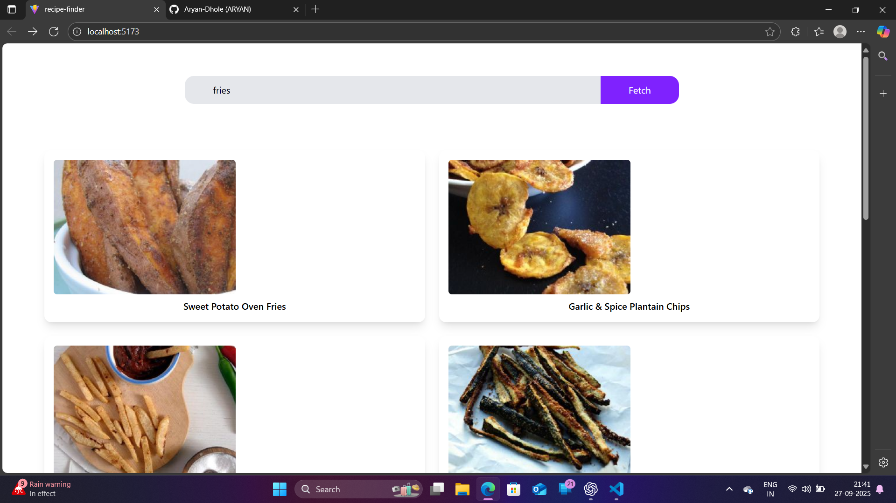

# 🍳 Recipe Explorer

A React app to discover recipes using the [Spoonacular API](https://spoonacular.com/food-api).  
Built with **React Router**, **Tailwind CSS**, and modern UI patterns.

---

## 🚀 Features
- 🔍 **Search Recipes** — Find recipes by keyword
- 📑 **Recipe List** — Browse through search results with images & titles
- 📄 **Recipe Detail Page** — View:
  - Title
  - Image
  - Summary (HTML rendered)
  - [More fields coming soon: ingredients, instructions, nutrition, etc.]

---

## 🛠️ Tech Stack
- **React** (Vite setup)
- **React Router** — for navigation between pages
- **Tailwind CSS** — for styling
- **Spoonacular API** — recipe data source

---

## 📂 Project Structure
src/
├── App.jsx
├── pages/
│ ├── Home.jsx
│ └── RecipeDetail.jsx
└── index.css

## ⚡ Getting Started

1. **Clone the repo**
   ```bash
   git clone https://github.com/your-username/recipe-explorer.git
   cd recipe-explorer

      cd recipe-explorer
Install dependencies

2. **Install dependencies** 
npm install
Add your API key

3. **Create a .env file in root:**
Copy code
VITE_SPOONACULAR_KEY=your_api_key_here
Replace API key usage inside your fetch calls.

4. **Run the app**
Copy code
npm run dev

## live Preview
[Check on Netlify](https://recipe-explorer-react.netlify.app/)

## 📸 Screenshots


.png>)


## 🔮 Next Steps

- Ingredient list with measures
- Step-by-step cooking instructions
- Save favorites (localStorage)
- Improved UI/UX with skeleton loaders


🤝 Feedback

This is an open build project.
If you have feedback, suggestions, or feature ideas — drop a comment or connect on [LinkedIn](https://www.linkedin.com/in/aryan-dhole-20a999381/).